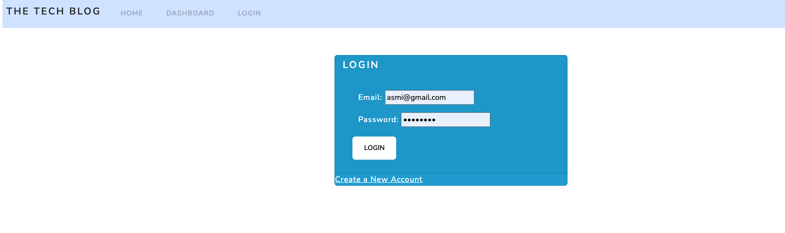
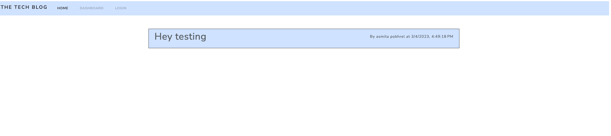
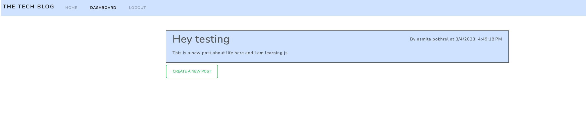
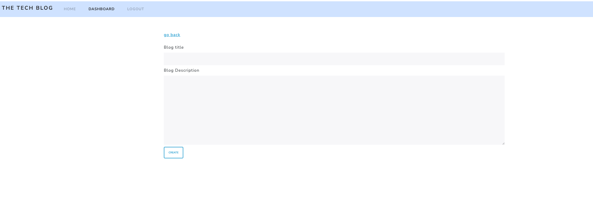
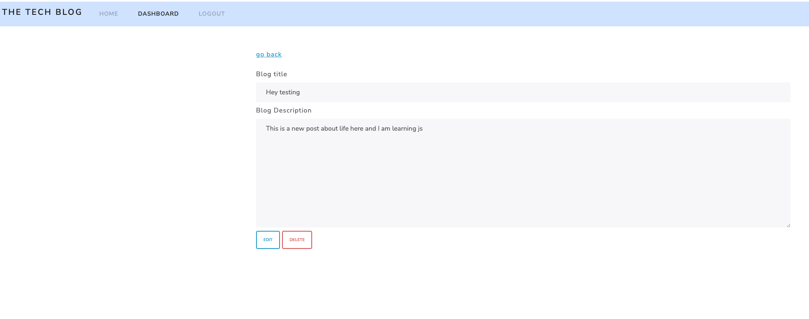

# Tech Blog

[Github link](https://github.com/devAsmi/tech-blogs)
## Table Of Contents

[Description](#description)

[Usuage Information](#usuage-information)

[Questions](#questions)

[License](#license)

[Screenshot](#Screenshot)

## Description

This is NodeJs application that allows users to create blog, update or delete them. It also allows the users to view blogs created by other users, and leave a comment on those.

## Usuage Information

Run `npm install` to install the dependencies and use `npm run start` to run the server.

## License

Licensed under the [MIT](https://choosealicense.com/licenses/mit) license

## Questions

[Github repo](https://github.com/devAsmi)

## Screenshot

